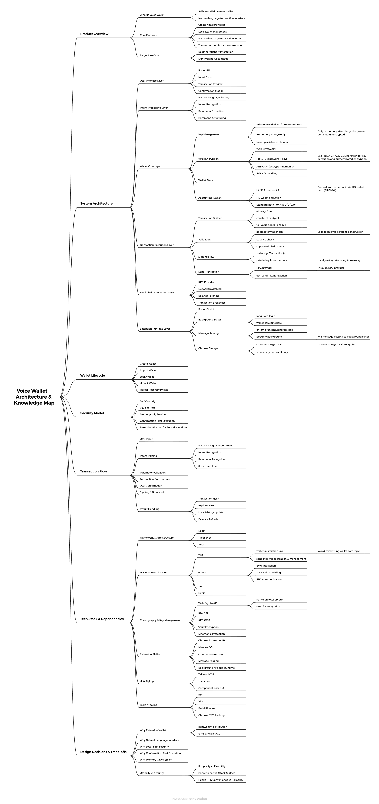

# Voice Wallet

🌐 语言: [English](./README.md) | 中文

> 一个面向 EVM 网络的轻量级自托管浏览器钱包，聚焦自然语言驱动的交易交互与本地优先安全模型。
---
## 🎥 演示视频
https://youtu.be/CS7R_RBFGTI

[](https://youtu.be/CS7R_RBFGTI)
## 项目简介

Voice Wallet 是一个浏览器扩展钱包，支持用户创建或导入钱包、本地解锁、解析自然语言转账指令，并在确认后执行链上交易。

产品强调：

- 自托管  
- 本地优先  
- 显式确认  
- 简洁交互  

---

## 为什么是 Voice Wallet

传统钱包操作路径复杂，容易产生误操作。

Voice Wallet 的设计目标：

- 用自然语言降低操作门槛  
- 将解析与执行严格分离  
- 强制确认关键交易信息  
- 提供更直观的交互体验  

---

## 核心能力

- 创建钱包并加密本地存储  
- 通过助记词导入钱包  
- 密码解锁  
- 助记词二次验证查看  
- 自然语言解析转账  
- 确认后才广播交易  
- 多网络支持  
- RPC fallback  
- 本地交易历史  
- 自动锁定  
- 轻量扩展 UI  

---

## 支持网络

- Ethereum 主网  
- Sepolia 测试网  
- Base  
- Arbitrum  

默认网络：**Sepolia Testnet**

---

## 交易流程

1. 输入自然语言指令  
2. 解析为交易意图  
3. 检查信息  
4. 确认  
5. 发送  
6. 展示结果  

> 解析不会触发交易，所有操作必须确认。

---

## 安全架构

### 加密存储
助记词在本地加密后存储。

### 密码解锁
通过密码解锁钱包。

### 内存会话
解锁状态仅存在内存中。

### 助记词保护
查看需再次验证密码。

### 显式确认
所有交易需确认。

---

## 安全原则

- 本地优先  
- 显式确认  
- 密码保护  
- 内存会话  
- 最小权限  

---

## 当前版本范围

当前版本聚焦：

- ETH 转账  
- 多链支持  
- 扩展钱包交互  
- 本地历史记录  

---

## 未来扩展

- ERC-20 支持  
- 多账户  
- 更完善历史系统  
- 更强确认机制  
- dApp 支持  
- 权限控制  
- 安全增强  


---

## 使用说明

### 安装

1. 构建项目  
2. 打开 chrome://extensions  
3. 开启开发者模式  
4. Load unpacked  

---

### 创建钱包

- 打开扩展  
- Create  
- 设置密码  

---

### 导入钱包

- Import  
- 输入助记词  
- 设置密码  

---

### 转账

示例：
```
send 0.0001 ETH to 0x…
```
流程：

1. Parse  
2. 检查  
3. Confirm  
4. 完成  

---

## 开发者指南

### 安装
```
npm install
npm run dev
npm run build
```

---

### 加载扩展

Chrome → Extensions → Load unpacked

---

## 技术栈

- WXT  
- React  
- TypeScript  
- WDK  
- viem  
- ethers  
- Web Crypto  
- bip39  

---

## 致谢

基于以下生态构建：

- WDK  
- EVM 工具链  
- Chrome 扩展  

---

## 路线图

- ERC-20  
- UX 优化  
- 多账户  
- 安全增强  

---

## 免责声明

Voice Wallet 是自托管钱包。

用户需自行负责：

- 密码  
- 助记词  
- 交易  
- 安全环境  

区块链交易不可逆，风险需自行承担。

---
### 架构与知识图谱



该图展示了系统的分层架构以及核心组件之间的关系。

---

## 项目链接

- GitHub Repository: https://github.com/mxdu-tech/voice-wallet
- Demo Video: (coming soon)
- Chrome Web Store: (coming soon)

## 许可证与致谢

### 许可证

本项目采用 MIT 许可证开源。详见 [LICENSE](./LICENSE) 文件。

### 致谢

本项目基于 WDK Starter Browser Extension（Apache-2.0 协议）开发。  
部分实现与架构设计参考了 WDK 生态及其相关开源组件。
